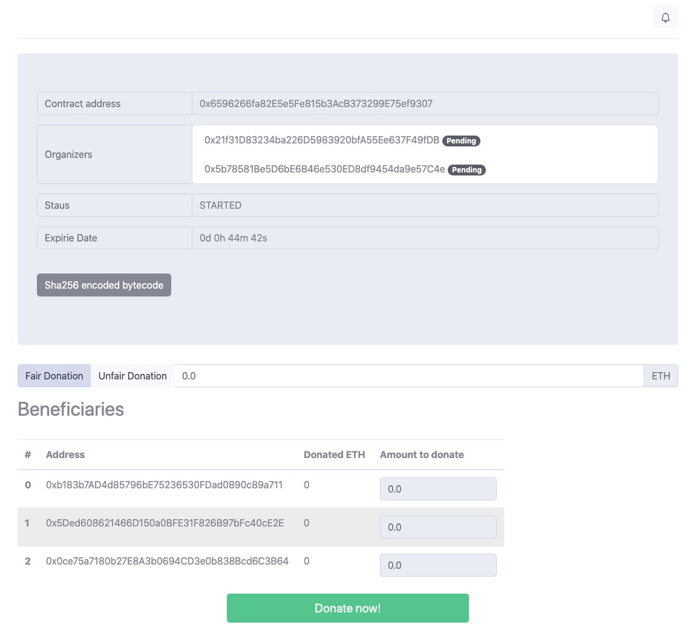
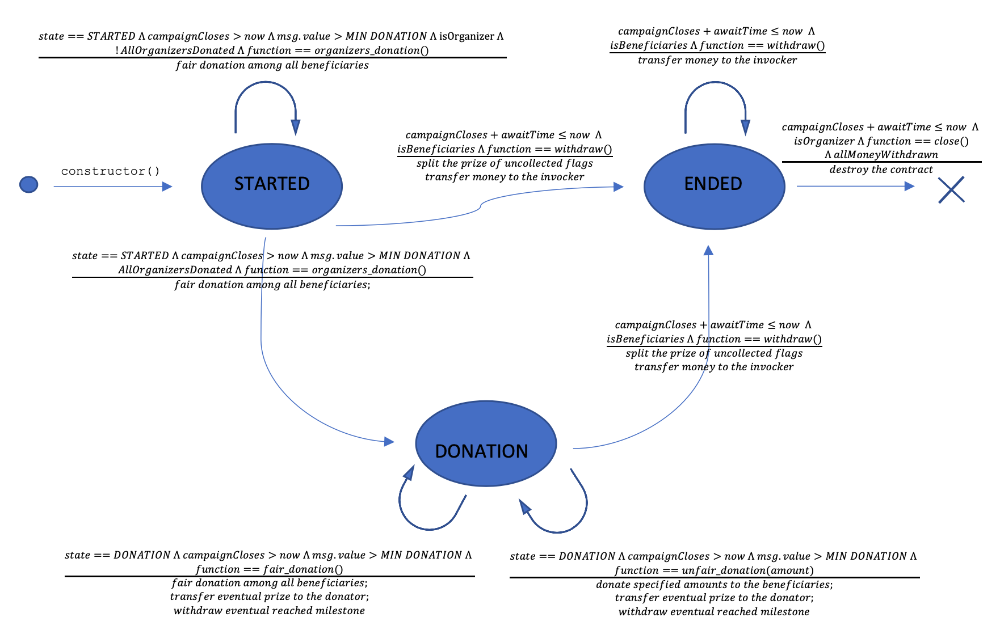

# EtherCrowdfunding
A decentralized crowdfunding platform

The crowdfunding campaign has three main actors: 

- the organizers, those who open the campaign
- the donors, those who donate to the campaign
- the beneficiaries, the receivers of the funds collected during the campaign.



## Before you get started
In order to build and run this project you need to install some dependencies:

- [NodeJs](https://nodejs.org/it/download/)
- [Truffle](https://www.trufflesuite.com/docs/truffle/getting-started/installation) 
- [Ganache](https://www.trufflesuite.com/ganache) - (Optional but highly recommended) use this to setup your testnet
 
## Build the project
If you have Truffle installed correctly just type
`truffle build`
in the root directory of the project

## Migration
Create your testnet and configure it in `truffle-config.js`
In the current version of the configuration file you can already find a network called `migration`:

``` 
migration: {
      host: "127.0.0.1",     // Localhost (default: none)
      port: 8545,            // Standard Ethereum port (default: none)
      network_id: "*",       // Any network (default: none)
    }
```

In case you want to use this configured network you can simply install Ganache and run a local test network on port 8545.

Before you start the migration, update the migration script `migrations/1_initial_migration.js` setting up the addresses of the organizers, the beneficiaries and the campaign duration. 
Thtat's it, these are the only required steps before of your first migration. 

Now migrate the contract using the command:
`truffle migrate --network migration --reset`

## Tests
Inside the `test/` folder you can find an automated test suite which attempts to prove and test some contract's properties.
To run the test suite just use `truffle test`

## Run the frontend (DAPP)
If you would like to run the DAPP fir of all you need to install lite-server

`npm install --save lite-server`

Then simply type in the root directory of the project `npm run dev` to start the server.
The DAPP will be available at `http://localhost:3000`

## How the contract works



